# 📚 EdraFlow V2.0

<div align="center">


**An AI-powered student platform that combines a curated PDF library, an intelligent university procedures chatbot (EdraChat), and an on-demand PDF Q&A engine — all in a single full-stack application.**

[🚀 Live Demo](https://edraflow-v2.vercel.app)

</div>

---

## 🚀 Overview

EdraFlow V2.0 is a **polyglot, microservices-based** academic platform built for university students. It solves three real student problems simultaneously:

| Problem | Solution |
|---------|----------|
| Scattered study materials | Centralized **PDF Library** with admin moderation |
| Opaque university procedures | **EdraChat AI** — a RAG chatbot grounded in real procedure data |
| Manual PDF reading for research | **PDF Chat** — upload any PDF and ask it questions instantly |

The platform is built across **four services** — a React frontend, a Node.js REST API, a Python FastAPI RAG service, and a Python FastAPI PDF-Chat service — wired together with JWT auth, Cloudinary storage, MongoDB, and Groq LLM inference.

---

## 📸 Screenshots


### 🏠 Home Page
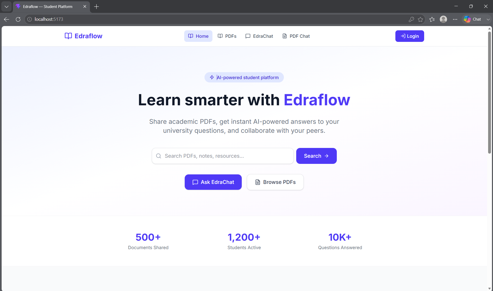

---

### 📚 PDF Library
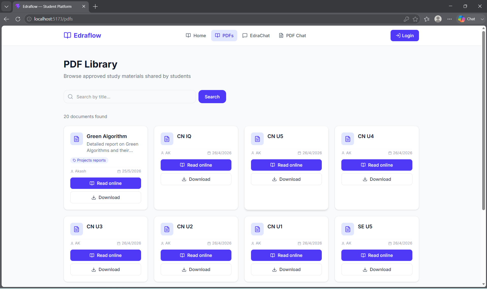

---

### 🤖 EdraChat — AI Chatbot
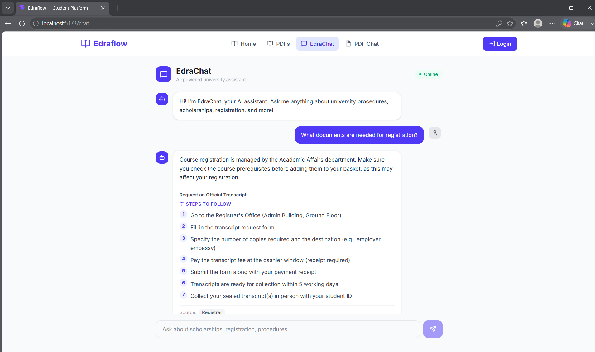

---

### 📄 PDF Chat
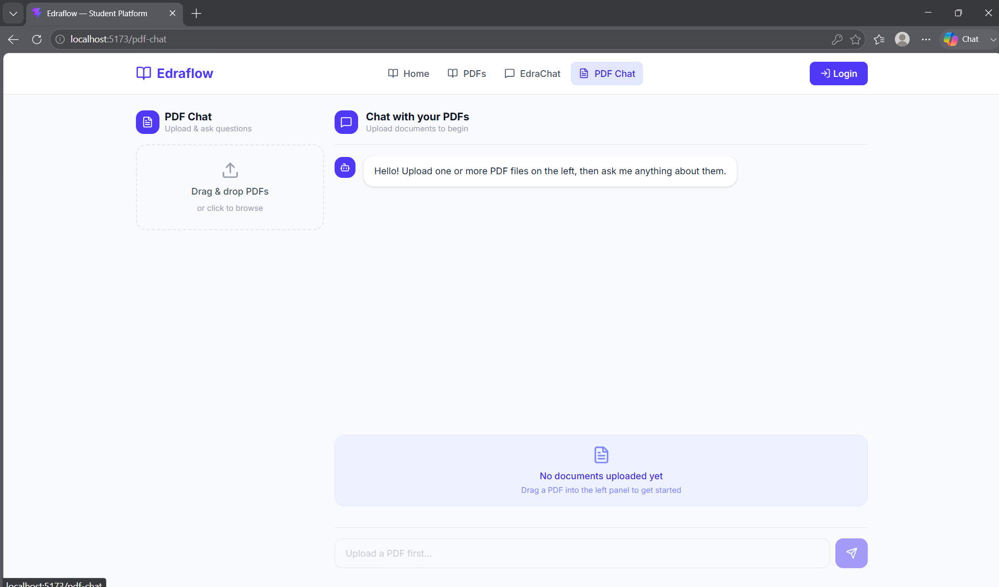
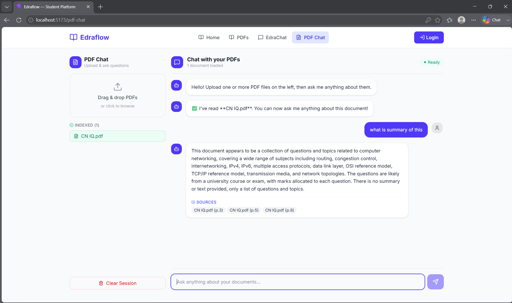

---

### 🔐 Login Page
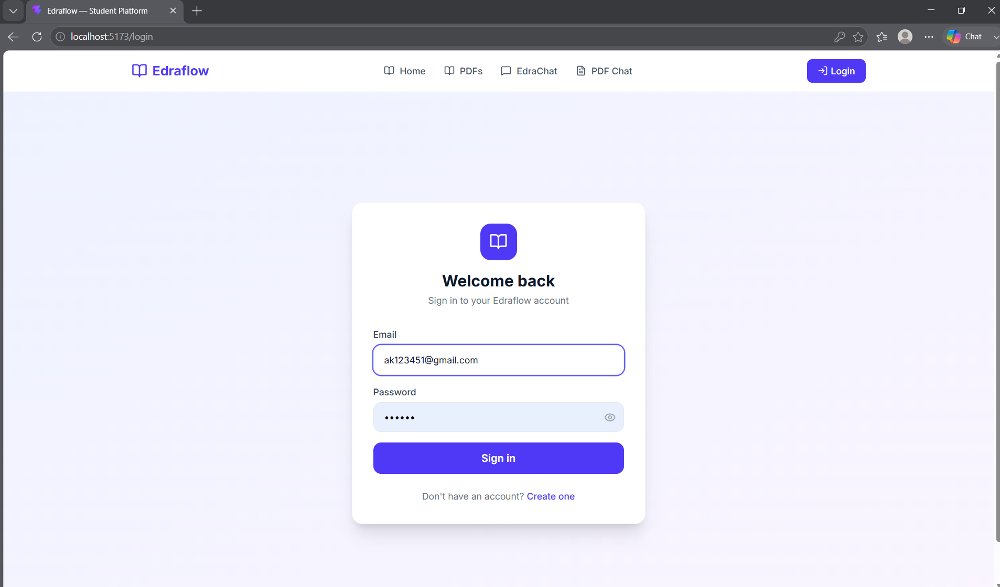

---

### 🛡️ Admin Dashboard
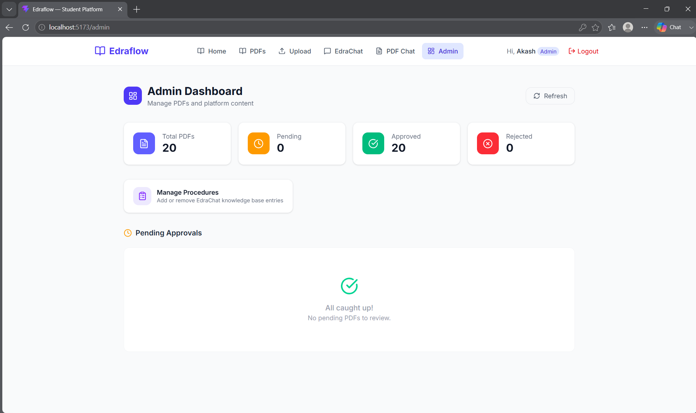

---

## ✨ Features

### 🗂 PDF Library
- Browse and search **community-uploaded academic PDFs**
- Paginated, filterable, tag-based discovery
- Admin review workflow: `pending → approved / rejected`
- Inline PDF viewer + download with proper `Content-Disposition`
- Cloudinary storage (up to **20 MB** per file)

### 🤖 EdraChat AI
- Conversational chatbot for **university procedure queries**
- Powered by **FAISS vector search** + **Groq Llama 3.1-8B**
- Cosine-similarity relevance threshold prevents hallucination
- Double-guardrail: vector score + LLM-level `[RELEVANT]` / `[OFF_TOPIC]` tagging
- Admin dashboard to **add, view, and delete** procedures in real-time (FAISS index rebuilds live)
- **Input validation** — `query` enforced 2–500 characters via Pydantic on every `/chat` request
- **Rate limiting (per IP via slowapi)** — `/chat` **10 req/min** · `/procedures` POST/DELETE **5 req/min** · `/reload` **2 req/min** · global **200 req/day**

### 📄 PDF Chat
- Upload **one or more PDFs** via drag-and-drop or file picker
- Session-scoped **ChromaDB** vector stores — each session is fully isolated
- Powered by **LangChain + HuggingFace Embeddings + Groq Llama 3.3-70B**
- Returns cited **source file + page number** for every answer
- One-click session cleanup
- **Input validation (two layers):**
  - *Client-side* — query is trimmed; if fewer than 2 characters a toast is shown and the API is never called (prevents blank-screen 422 errors)
  - *Server-side* — Pydantic strips whitespace and re-enforces ≥ 2 non-whitespace characters, returning a clear error message if the check fails
- **File limits** — max **20 MB** per PDF · max **5 PDFs** per session
- **Rate limiting (per IP via slowapi)** — `/upload` capped at **5 req/min** · `/chat` capped at **15 req/min**

### 🔐 Auth & Roles
- JWT-based authentication (access token in-memory, refresh via re-login)
- Role model: `student` (default) and `admin`
- Private routes: upload requires login; admin panel requires `role=admin`

---

## 🏗️ System Architecture

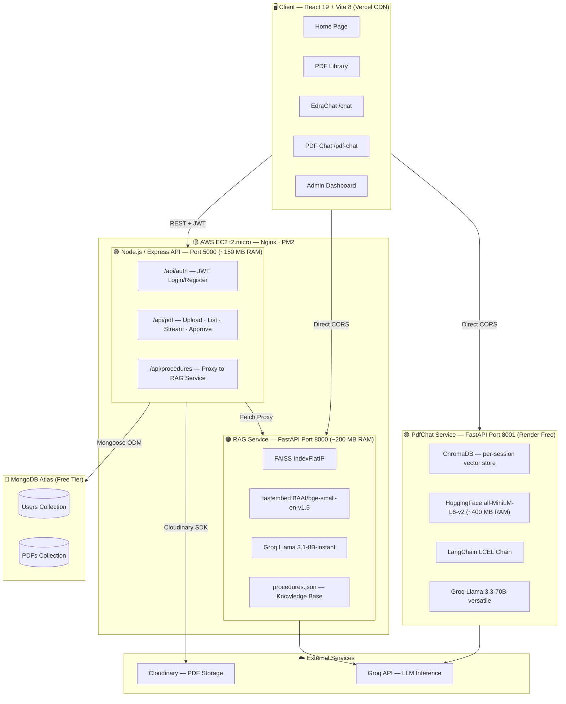

---

## 🔄 End-to-End Workflows

### EdraChat — Procedure Query Pipeline

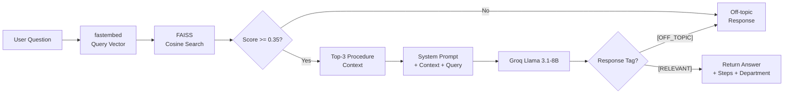

---

### PDF Chat — Ingestion & Query Pipeline

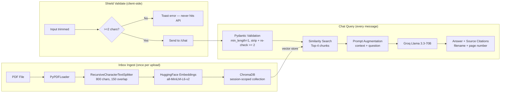

---

### PDF Library — Upload & Moderation Flow

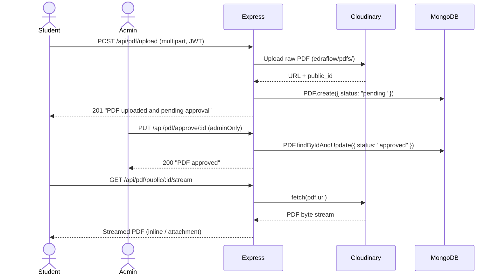

---

## 📂 Project Structure

```
EdraFlow_V2.0/
│
├── client/                          # React 19 + Vite 8 frontend
│   ├── src/
│   │   ├── api/                     # Axios instances (main API, RAG, PdfChat)
│   │   ├── components/
│   │   │   ├── Navbar.jsx
│   │   │   ├── PrivateRoute.jsx     # Redirect unauthenticated users
│   │   │   └── AdminRoute.jsx       # Restrict to role=admin
│   │   ├── context/
│   │   │   └── AuthContext.jsx      # JWT state, login/logout helpers
│   │   ├── pages/
│   │   │   ├── Home.jsx             # Landing + search + feature cards
│   │   │   ├── Login.jsx
│   │   │   ├── Register.jsx
│   │   │   ├── PublicPDFs.jsx       # Paginated PDF library
│   │   │   ├── PdfViewer.jsx        # Iframe PDF viewer
│   │   │   ├── UploadPDF.jsx        # Authenticated upload form
│   │   │   ├── Chat.jsx             # EdraChat AI interface
│   │   │   ├── PdfChat.jsx          # PDF Chat (drag-drop, session, chat)
│   │   │   └── admin/
│   │   │       ├── AdminDashboard.jsx     # PDF moderation (approve/reject)
│   │   │       └── ManageProcedures.jsx   # CRUD for EdraChat knowledge base
│   │   ├── App.jsx                  # Router + AuthProvider
│   │   └── main.jsx
│   ├── .env.example
│   ├── vite.config.js
│   └── package.json
│
├── server/                          # Node.js + Express REST API
│   ├── src/
│   │   ├── controllers/
│   │   │   ├── authController.js    # Register, Login (JWT signing)
│   │   │   ├── pdfController.js     # Upload, list, stream, approve, reject
│   │   │   └── procedureController.js  # Proxy CRUD to RAG service
│   │   ├── middleware/
│   │   │   ├── auth.js              # protect + adminOnly middleware
│   │   │   ├── upload.js            # Multer + Cloudinary storage
│   │   │   └── errorHandler.js      # Global async error handler
│   │   ├── models/
│   │   │   ├── User.js              # bcrypt hashing, role enum
│   │   │   └── PDF.js               # status enum, Cloudinary ref
│   │   └── routes/
│   │       ├── authRoutes.js
│   │       ├── pdfRoutes.js
│   │       └── procedureRoutes.js
│   ├── server.js                    # Express app entry point
│   ├── .env.example
│   └── package.json
│
├── rag/                             # EdraChat RAG microservice (FastAPI)
│   ├── data/
│   │   └── procedures.json          # University procedures knowledge base
│   ├── rag_engine.py                # FAISS index + Groq chat + CRUD
│   ├── main.py                      # FastAPI app with lifespan + endpoints
│   ├── requirements.txt
│   └── .env.example
│
├── PdfChat/                         # PDF Chat microservice (FastAPI)
│   ├── chroma_store/                # Persistent ChromaDB storage
│   ├── pdf_rag.py                   # Session-scoped PdfRAGEngine class
│   ├── main.py                      # FastAPI app, session mgmt, validation
│   ├── requirements.txt
│   └── .env.example
│
└── README.md
```

---

## 🛠️ Tech Stack

### Frontend

| Technology | Version | Purpose |
|------------|---------|---------|
| React | 19 | UI Framework |
| Vite | 8 | Build Tool + Dev Server |
| TailwindCSS | 4 | Utility-First CSS |
| React Router | 7 | Client-Side Routing |
| Axios | 1.14 | HTTP Client |
| Lucide React | Latest | Icon Library |
| React Hot Toast | 2.6 | Notification System |

### Backend (Express API)

| Technology | Version | Purpose |
|------------|---------|---------|
| Node.js + Express | 4.19 | REST API |
| Mongoose | 8.4 | MongoDB ODM |
| jsonwebtoken | 9 | JWT Auth |
| bcryptjs | 2.4 | Password Hashing |
| Multer + Cloudinary | Latest | PDF Upload Pipeline |
| Morgan | 1.10 | HTTP Request Logging |
| express-async-errors | 3.1 | Global Async Error Handling |

### RAG Service (FastAPI)

| Technology | Version | Purpose |
|------------|---------|---------|
| FastAPI | 0.111 | REST API Framework |
| fastembed | 0.8 | Local Text Embeddings (BAAI/bge-small-en-v1.5) |
| FAISS-cpu | >=1.9 | Vector Similarity Search |
| Groq SDK | 0.18 | LLM Inference (Llama 3.1-8B) |
| NumPy | >=2.1 | Vector Math |
| Pydantic | >=2.10 | Request/Response Validation |
| slowapi | >=0.1.9 | IP-based Rate Limiting |

### PdfChat Service (FastAPI)

| Technology | Version | Purpose |
|------------|---------|---------|
| FastAPI | Latest | REST API Framework |
| LangChain | Latest | RAG Orchestration (LCEL) |
| langchain-huggingface | Latest | HuggingFace Embeddings (all-MiniLM-L6-v2) |
| ChromaDB | Latest | Persistent Session Vector Store |
| langchain-groq | Latest | Groq LLM Wrapper (Llama 3.3-70B) |
| PyPDF | Latest | PDF Text Extraction |
| python-multipart | Latest | File Upload Support |
| slowapi | Latest | IP-based Rate Limiting |

### Infrastructure

| Service | Purpose |
|---------|---------|
| MongoDB Atlas | Cloud Database |
| Cloudinary | PDF File Storage (CDN) |
| Groq Cloud | Ultra-fast LLM API |
| Vercel | Frontend Deployment |
| AWS EC2 t2.micro | Express API + RAG Service |
| Render (Free) | PdfChat Service |

---

## ⚙️ Local Development Setup

### Prerequisites

- **Node.js** >= 18
- **Python** >= 3.10
- **MongoDB Atlas** account (free tier works)
- **Cloudinary** account (free tier works)
- **Groq API key** — [get one free](https://console.groq.com)

---

### 1. Clone the Repository

```bash
git clone https://github.com/AkashSingh040/EdraFlow_V2.0.git
cd EdraFlow_V2.0
```

---

### 2. Setup — Node.js API Server

```bash
cd server
npm install
cp .env.example .env
```

Edit `server/.env`:

```env
PORT=5000
MONGO_URI=mongodb+srv://<username>:<password>@cluster.mongodb.net/edraflow
JWT_SECRET=your_super_secret_jwt_key_change_in_production
CLOUDINARY_NAME=your_cloudinary_cloud_name
CLOUDINARY_KEY=your_cloudinary_api_key
CLOUDINARY_SECRET=your_cloudinary_api_secret
CLIENT_URL=http://localhost:5173
RAG_URL=http://localhost:8000
```

Start the server:

```bash
npm run dev
# Server running on http://localhost:5000
```

---

### 3. Setup — EdraChat RAG Service

```bash
cd rag

python -m venv .venv

# Windows
.venv\Scripts\activate
# macOS / Linux
source .venv/bin/activate

pip install -r requirements.txt
cp .env.example .env
```

Edit `rag/.env`:

```env
GROQ_API_KEY=gsk_your_groq_api_key_here
# Optional — override default models:
# GROQ_CHAT_MODEL=llama-3.1-8b-instant
# EMBED_MODEL=BAAI/bge-small-en-v1.5
```

Start the RAG service:

```bash
uvicorn main:app --host 0.0.0.0 --port 8000 --reload
# Edraflow RAG API running on http://localhost:8000
# Auto-docs: http://localhost:8000/docs
```

---

### 4. Setup — PDF Chat Service

```bash
cd PdfChat

python -m venv .venv

# Windows
.venv\Scripts\activate
# macOS / Linux
source .venv/bin/activate

pip install -r requirements.txt
cp .env.example .env
```

Edit `PdfChat/.env`:

```env
GROQ_API_KEY=gsk_your_groq_api_key_here
```

Start the PDF Chat service:

```bash
uvicorn main:app --host 0.0.0.0 --port 8001 --reload
# EdraFlow PDF Chat API running on http://localhost:8001
# Auto-docs: http://localhost:8001/docs
```

---

### 5. Setup — React Frontend

```bash
cd client
npm install
cp .env.example .env
```

Edit `client/.env`:

```env
VITE_API_URL=http://localhost:5000/api
VITE_RAG_URL=http://localhost:8000
VITE_PDF_CHAT_URL=http://localhost:8001
```

Start the dev server:

```bash
npm run dev
# Frontend running on http://localhost:5173
```

---

### All Services at a Glance

| Service | Command | URL | Deployed On |
|---------|---------|-----|-------------|
| React Frontend | `npm run dev` (in `/client`) | http://localhost:5173 | Vercel |
| Express API | `npm run dev` (in `/server`) | http://localhost:5000 | AWS EC2 t2.micro |
| RAG Service | `uvicorn main:app --port 8000 --reload` (in `/rag`) | http://localhost:8000 | AWS EC2 t2.micro |
| PDF Chat | `uvicorn main:app --port 8001 --reload` (in `/PdfChat`) | http://localhost:8001 | Render (Free) |

---

## 📄 API Reference

### Express REST API (`/api`)

#### Auth

| Method | Endpoint | Auth | Description |
|--------|----------|------|-------------|
| `POST` | `/api/auth/register` | Public | Register a new student account |
| `POST` | `/api/auth/login` | Public | Login, returns JWT |

#### PDF Library

| Method | Endpoint | Auth | Description |
|--------|----------|------|-------------|
| `GET` | `/api/pdf/public` | Public | List approved PDFs (paginated, filterable) |
| `GET` | `/api/pdf/public/:id` | Public | Get single PDF metadata |
| `GET` | `/api/pdf/public/:id/stream` | Public | Stream / download PDF file |
| `POST` | `/api/pdf/upload` | Student | Upload a PDF (stored in Cloudinary) |
| `GET` | `/api/pdf/my` | Student | List own uploaded PDFs |
| `DELETE` | `/api/pdf/:id` | Student / Admin | Delete PDF (owner or admin) |
| `GET` | `/api/pdf/pending` | Admin | List PDFs awaiting approval |
| `GET` | `/api/pdf/all` | Admin | List all PDFs (any status) |
| `PUT` | `/api/pdf/approve/:id` | Admin | Approve a pending PDF |
| `PUT` | `/api/pdf/reject/:id` | Admin | Reject a pending PDF |

#### Procedures (proxied to RAG service)

| Method | Endpoint | Auth | Description |
|--------|----------|------|-------------|
| `GET` | `/api/procedures` | Admin | List all procedures |
| `POST` | `/api/procedures` | Admin | Add a new procedure |
| `DELETE` | `/api/procedures/:id` | Admin | Delete a procedure |

---

### RAG Service (`http://localhost:8000`)

| Method | Endpoint | Rate Limit | Description |
|--------|----------|------------|-------------|
| `GET` | `/health` | 60/min | Health check + FAISS index size |
| `POST` | `/chat` | 10/min | `{ query }` → `{ answer, steps, source, title, score }` |
| `POST` | `/reload` | 2/min | Rebuild FAISS index from procedures.json |
| `GET` | `/procedures` | 30/min | Return all procedures |
| `POST` | `/procedures` | 5/min | Add a procedure + rebuild index |
| `DELETE` | `/procedures/{id}` | 5/min | Delete a procedure + rebuild index |

#### RAG `/chat` Input Validation

| Field | Rule |
|-------|------|
| `query` | Required · **2–500 characters** · enforced by Pydantic `Field(min_length=2, max_length=500)` |

---

### PDF Chat Service (`http://localhost:8001`)

| Method | Endpoint | Description |
|--------|----------|-------------|
| `GET` | `/health` | Health check + active session count |
| `POST` | `/upload` | Upload PDFs (multipart), returns `session_id` |
| `POST` | `/chat` | `{ session_id, query }` → `{ answer, sources }` |
| `GET` | `/session/{id}/files` | List files in a session |
| `DELETE` | `/session/{id}` | Cleanup session + ChromaDB collection |

#### `/chat` Request Validation Rules

| Field | Rule |
|-------|------|
| `session_id` | Required · UUID string (1–36 chars) |
| `query` | Required · 1–1000 chars (raw) · **>= 2 non-whitespace chars after strip** |

> Queries shorter than 2 characters are blocked on the **client** (toast notification) before they reach the server. The Pydantic validator provides a second layer of enforcement after whitespace stripping.

---

## 🧠 How the AI Features Work

### EdraChat RAG — Under the Hood

**1. Indexing (startup)**
```
procedures.json → _procedure_to_text() → fastembed (BAAI/bge-small-en-v1.5)
→ L2-normalized float32 vectors → FAISS IndexFlatIP
```

**2. Query**
```
User query → query vector → faiss.index.search(top_k=3)
→ cosine scores → threshold check (0.35) → build context string
→ Groq system prompt with rules → LLM response → parse [RELEVANT]/[OFF_TOPIC]
→ return { answer, steps, source, title, score }
```

**Key design choice — double guardrail:**
- **Score threshold (0.35):** If the best FAISS cosine similarity is below 0.35, the LLM is never called. This prevents wasting tokens on completely unrelated queries.
- **LLM self-classification:** The system prompt instructs the model to prefix responses with `[RELEVANT]` or `[OFF_TOPIC]`, giving a second layer of safety.

---

### PDF Chat — Under the Hood

**1. Upload → Ingest**
```
PDF file → PyPDFLoader → RecursiveCharacterTextSplitter (800 chars, 150 overlap)
→ HuggingFace all-MiniLM-L6-v2 embeddings → ChromaDB session collection
```

**2. Chat Query**
```
User types query → client trims + checks len >= 2 → POST /chat
→ Pydantic strips whitespace + re-validates >= 2 chars
→ ChromaDB similarity search (top-4 chunks)
→ LangChain LCEL chain: { context | question }
→ ChatPromptTemplate → ChatGroq (Llama 3.3-70B)
→ StrOutputParser → answer + source citations (filename + page number)
```

**Session isolation:** Each upload creates a unique `session_id` (UUID). The ChromaDB collection is named `pdf_session_{uuid}`. Multiple users can simultaneously chat with different PDFs without any data leakage.

**Security & limits:**
- Max **20 MB** per PDF file
- Max **5 PDF files** per session
- Rate limited: `/upload` → 5 req/min · `/chat` → 15 req/min (per IP via slowapi)

---

## 🐛 Bug Fixes & Changelog

### v2.0.1 — PDF Chat Input Validation Fix

**Problem:** Typing a single character (e.g., `n`) and pressing Enter sent a 1-character query to the backend. Pydantic's `Field(min_length=2)` rejected it with a raw **422 Unprocessable Content** response before the friendly validator could run, causing the React UI to blank out.

**Root cause:**
```python
# Before — Field-level min_length=2 fires before the custom validator
query: str = Field(..., min_length=2, ...)
```

**Fix — two layers:**

1. **Frontend (`PdfChat.jsx`)** — Pre-flight guard added to `sendMessage`:
   ```js
   if (text.length < 2) {
     toast.error("Please enter at least 2 characters.");
     return; // never reaches the API
   }
   ```

2. **Backend (`PdfChat/main.py`)** — Moved enforcement to the custom validator:
   ```python
   # After — Field allows 1 char; validator strips and re-checks >= 2
   query: str = Field(..., min_length=1, ...)

   @field_validator("query")
   def strip_query(cls, v):
       stripped = v.strip()
       if len(stripped) < 2:
           raise ValueError("Query must be at least 2 non-whitespace characters.")
       return stripped
   ```

   Now any query that slips through returns a clear, user-readable 422 detail instead of a cryptic Pydantic schema error.

---

## 💻 Usage Examples

### EdraChat

```
URL: http://localhost:5173/chat

User: How do I apply for a scholarship?

EdraChat: To apply for a scholarship, visit the Financial Aid Office
with your academic transcripts and income documentation.
The application window opens each October.

Steps:
  1. Collect academic transcripts and proof of income
  2. Fill the scholarship application form (available on the portal)
  3. Submit to the Financial Aid Office before the deadline
  4. Await email notification with the decision

Department: Financial Aid Office
```

---

### PDF Chat

```
URL: http://localhost:5173/pdf-chat

→ Drag and drop "Research_Paper.pdf" into the upload panel
→ "I have read Research_Paper.pdf. You can now ask me anything!"

User: What methodology did the authors use?

Bot: The authors used a mixed-methods approach combining...
     Sources: Research_Paper.pdf (p.3), Research_Paper.pdf (p.7)

User: n  [presses Enter]
→ Toast: "Please enter at least 2 characters."  — no API call, no blank screen
```

---

## 🚀 Deployment

> **Architecture:** React frontend on **Vercel** (CDN, free) · Express API + RAG service on **AWS EC2 t2.micro** (Nginx + PM2) · PdfChat service on **Render** (free) · MongoDB Atlas + Cloudinary on their free tiers.

---

### Frontend — Vercel

```bash
cd client
npm run build
# Deploy via Vercel CLI or GitHub integration
```

Set environment variables in the Vercel dashboard:

```env
VITE_API_URL=http://<YOUR_EC2_PUBLIC_IP>/api
VITE_RAG_URL=http://<YOUR_EC2_PUBLIC_IP>/rag
VITE_PDF_CHAT_URL=https://your-pdf-chat-service.onrender.com
```

---

### Express API + RAG Service — AWS EC2 (t2.micro)

> **Why EC2?** Both services are memory-light: Express ~150 MB, fastembed + FAISS RAG ~200 MB. Total fits comfortably inside the 1 GB free-tier limit (with 2 GB swap as safety net).

#### 1. Launch EC2 Instance
- AMI: **Ubuntu 22.04 LTS**
- Instance type: `t2.micro` (free tier)
- Security Group — inbound rules:
  ```
  Port 22   — SSH (your IP only)
  Port 80   — HTTP (anywhere)
  Port 5000 — Express API (anywhere)
  Port 8000 — RAG Service (anywhere)
  ```

#### 2. Add Swap Space (recommended for t2.micro)

```bash
sudo fallocate -l 2G /swapfile
sudo chmod 600 /swapfile
sudo mkswap /swapfile
sudo swapon /swapfile
echo '/swapfile none swap sw 0 0' | sudo tee -a /etc/fstab
```

#### 3. Install Dependencies

```bash
# Node.js 18
curl -fsSL https://deb.nodesource.com/setup_18.x | sudo -E bash -
sudo apt install -y nodejs

# Python 3.10 + venv
sudo apt install -y python3.10 python3.10-venv python3-pip

# PM2 (process manager)
sudo npm install -g pm2

# Nginx (reverse proxy)
sudo apt install -y nginx
```

#### 4. Clone & Configure

```bash
git clone https://github.com/AkashSingh040/EdraFlow_V2.0.git
cd EdraFlow_V2.0

# Express API
cd server && npm install
cp .env.example .env
# Fill in MONGO_URI, JWT_SECRET, CLOUDINARY_*, CLIENT_URL, RAG_URL

# RAG Service
cd ../rag
python3.10 -m venv .venv && source .venv/bin/activate
pip install -r requirements.txt
cp .env.example .env
# Fill in GROQ_API_KEY
```

#### 5. Start Services with PM2

Create `ecosystem.config.js` in the project root:

```js
// ecosystem.config.js
module.exports = {
  apps: [
    {
      name: "express-api",
      cwd: "/home/ubuntu/EdraFlow_V2.0/server",
      script: "server.js",
      env: { NODE_ENV: "production", PORT: 5000 },
    },
    {
      name: "rag-service",
      cwd: "/home/ubuntu/EdraFlow_V2.0/rag",
      interpreter: "/home/ubuntu/EdraFlow_V2.0/rag/.venv/bin/python",
      script: "/home/ubuntu/EdraFlow_V2.0/rag/.venv/bin/uvicorn",
      args: "main:app --host 0.0.0.0 --port 8000",
    },
  ],
};
```

```bash
pm2 start ecosystem.config.js
pm2 startup   # auto-start on reboot
pm2 save
```

#### 6. Nginx Reverse Proxy

```nginx
# /etc/nginx/sites-available/edraflow
server {
    listen 80;
    server_name <YOUR_EC2_PUBLIC_IP>;

    # Express API
    location /api/ {
        proxy_pass http://localhost:5000;
        proxy_set_header Host $host;
        proxy_set_header X-Real-IP $remote_addr;
    }

    # RAG Service
    location /rag/ {
        proxy_pass http://localhost:8000/;
        proxy_set_header Host $host;
        proxy_set_header X-Real-IP $remote_addr;
    }
}
```

```bash
sudo ln -s /etc/nginx/sites-available/edraflow /etc/nginx/sites-enabled/
sudo nginx -t && sudo systemctl reload nginx
```

> **Note:** The RAG service downloads the `BAAI/bge-small-en-v1.5` embedding model (~130 MB) on first startup. Allow 1–2 minutes for cold boot on EC2.

---

### PdfChat Service — Render (Free Tier)

The PdfChat service uses HuggingFace `all-MiniLM-L6-v2` (~400 MB RAM) which exceeds the EC2 free-tier budget, so it runs on Render.

- **Root directory:** `PdfChat`
- **Build command:** `pip install -r requirements.txt`
- **Start command:** `uvicorn main:app --host 0.0.0.0 --port 8001`
- **Environment variable:** `GROQ_API_KEY`

> **Cold start warning:** Render free-tier instances spin down after inactivity. The first request after idle will take ~30–60 seconds while `all-MiniLM-L6-v2` reloads (~400 MB).

---

## 🗂 Knowledge Base — Adding University Procedures

The EdraChat knowledge base lives in `rag/data/procedures.json`.

Each procedure follows this schema:

```json
{
  "id": "scholarship-application",
  "title": "How to Apply for a Scholarship",
  "steps": [
    "Collect academic transcripts and income proof",
    "Fill the scholarship application form on the portal",
    "Submit to the Financial Aid Office before the deadline",
    "Await decision via email"
  ],
  "tags": ["scholarship", "financial aid", "application"],
  "department": "Financial Aid Office",
  "contact": "financialaid@university.edu"
}
```

**Add a procedure via the Admin Dashboard** (`/admin/procedures`) — the FAISS index rebuilds automatically on every change.

Or use the API directly:

```bash
curl -X POST http://localhost:8000/procedures \
  -H "Content-Type: application/json" \
  -d '{
    "id": "exam-appeal",
    "title": "How to Appeal an Exam Grade",
    "steps": ["Submit appeal form within 7 days", "..."],
    "tags": ["exam", "grade", "appeal"],
    "department": "Academic Affairs",
    "contact": "appeals@university.edu"
  }'
```

---

## 🎯 Learning Outcomes

Building and studying this project teaches:

**Full-Stack Architecture**
- Polyglot microservices (Node.js + Python FastAPI)
- Service-to-service communication via HTTP proxy
- JWT authentication across multiple services

**AI / RAG Engineering**
- Vector embeddings and FAISS similarity search
- LangChain LCEL pipeline composition
- ChromaDB session-scoped vector stores
- Relevance thresholding and LLM self-classification
- Groq ultra-fast LLM inference

**Backend Engineering**
- MongoDB schema design with Mongoose
- File upload pipelines with Multer + Cloudinary
- Stream proxying for large binary files
- Role-based access control middleware
- Input validation layering (client guard → Pydantic Field → custom validator)

**Frontend Engineering**
- React 19 with context-based auth state
- Drag-and-drop file handling
- Session management across React components
- Optimistic UI updates with React Hot Toast
- Defensive programming: client-side guards before API calls

**Cloud & DevOps**
- Cost-optimised hybrid deployment across AWS EC2, Vercel, and Render
- Nginx reverse proxy configuration for multi-service routing
- PM2 process management with auto-restart and startup hooks
- Linux server administration (swap tuning, security groups, SSH hardening)

---

## 🔮 Future Improvements

- 🌐 **Multi-language support** (Hindi, Urdu,local languages) for university procedures
- 🔁 **Conversation memory** in EdraChat (multi-turn context)
- 📑 **Source citations** in EdraChat (link back to procedure)
- 🔍 **Hybrid search** (BM25 + vector) in RAG service
- 📊 **Usage analytics** dashboard for admins
- 🧪 **Automated testing** with Pytest (RAG) + Vitest (React)
- 🐳 **Docker Compose** for one-command local setup
- 🔔 **Email notifications** for PDF approval/rejection
- 👥 **Student profiles** with upload history

---

## 🤝 Contributing

Contributions, improvements, and suggestions are welcome.

1. Fork the repository
2. Create a feature branch: `git checkout -b feature/my-feature`
3. Commit your changes: `git commit -m "feat: add my feature"`
4. Push to the branch: `git push origin feature/my-feature`
5. Open a Pull Request

Please follow [Conventional Commits](https://www.conventionalcommits.org/) for commit messages.

---

## 📜 License

This project is licensed under the **MIT License** — see the [LICENSE](LICENSE) file for details.

---

<div align="center">

### 👨‍💻 Author

**Akash Singh**

B.Tech Computer Science & Engineering

[](https://github.com/AkashSingh040)

⭐ If you found this project helpful, please give it a star — it helps others discover it!

</div>
